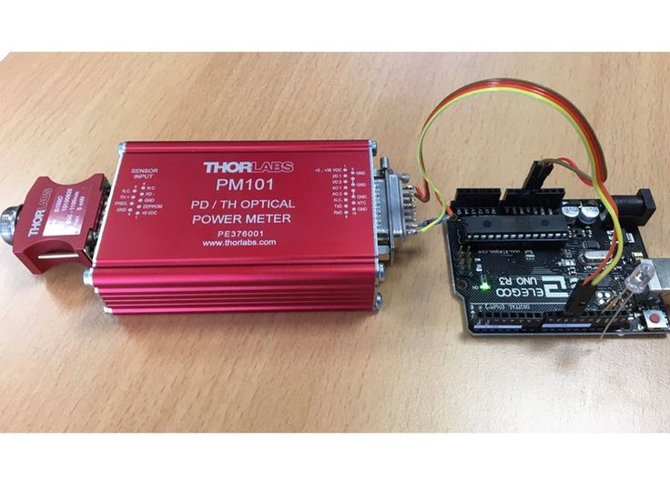
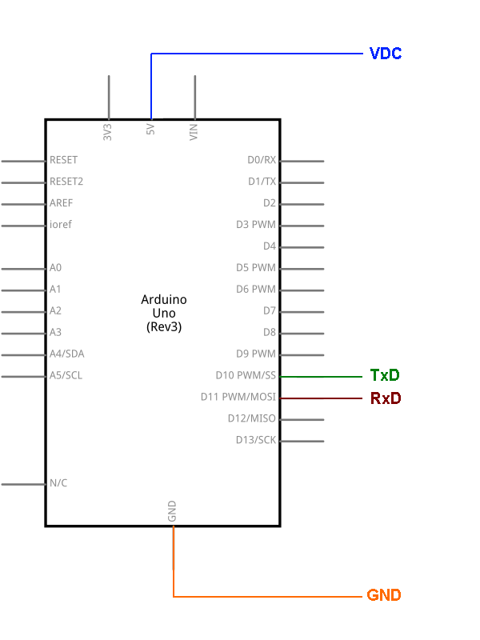
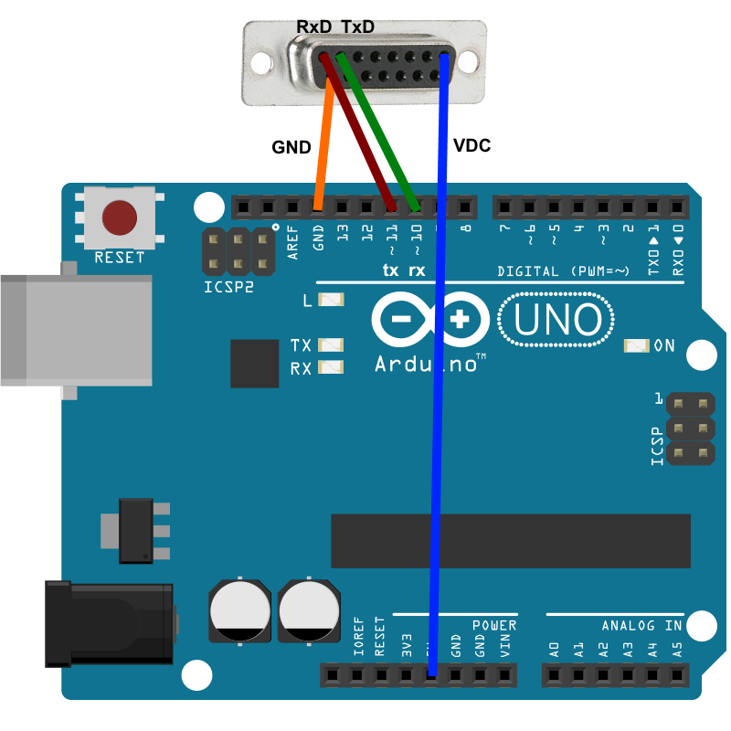

# PM101 with Arduino

Connect your Arduino with a Thorlabs PM101
In this project, a Thorlabs PM101 is connected to an Arduino via the serial interface so that you can read the measured values. 

As an application example, you can display the measured value on the Arduino and build your own handheld power meter. 

 

### Step 1: Preparation 

The PM101 must be switched from RS232 operation with ±5 V to UART operation. 

Remove the bolts from the 15pin sub-d connector. 
Remove the 4 TX9 screws in the sensor front panel. 
Pull out the PCB. 
Move both switches from PC RS232 Operation (default - both switches in upper position) to ± 5 V level UART (both switches in lower position) 
Detailed description of the switch to UART see: "Write your own application" chapter 2.1 

[https://www.thorlabs.com/_sd.cfm?fileName=MTN013681-D04.pdf&partNumber=PM101R](https://www.thorlabs.com/_sd.cfm?fileName=MTN013681-D04.pdf&partNumber=PM101R)

### Step 2: Installation 

Set the Arduino Uno supported baudrate for the PM101 using one of the possibilities: 

The function "Set Baudrate" of the TLPM driver 
SCPI command "SYST:SEN:TRAN:BAUD" in the Thorlabs Instrument Communicator or in the Thorlabs OPM Terminal 

### Step 3: Assemble the circuit 

Connect four pins of the Thorlabs PM101 to the Arduino Uno board following the diagram connections.png attached to the sketch 

### Step 4: Load the code 
Upload the code in PM10x.ino on to your board 

